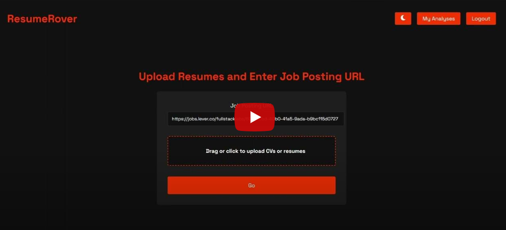

# ResumeRover

## Project Overview

ResumeRover is an innovative web application designed to automate and streamline the hiring process by efficiently analyzing resumes against job descriptions. This project leverages modern web technologies and generative AI to reduce the manual effort involved in screening candidates, enhancing the recruitment process's speed and accuracy.

[](https://youtu.be/eUdHY9dxI4Y "ResumeRover")

The application consists of two main components:

- **Frontend**: A user-friendly interface built with React, allowing users to interact with the application seamlessly.
- **Backend**: A robust server built with Node.js and Express that handles API requests, processes data, and integrates AI functionalities.

## Key Features

- **Resume Parsing**: Automates the extraction of relevant information from resumes.
- **Job Description Analysis**: Analyzes job descriptions to identify key requirements.
- **Candidate Matching**: Uses AI algorithms to match candidates with job openings based on their qualifications and the job requirements.
- **User Management**: Allows recruiters to manage their job postings and review candidate matches.

## Technology Stack

- **Frontend**: React, Redux for state management.
- **Backend**: Node.js, Express, Python for AI components and Gemini LLM.

For detailed information on the setup, dependencies, and specific configurations of each component, please refer to the respective README files in the frontend and backend directories.

## Getting Started

To get a local copy up and running, follow these simple example steps:

1. Clone the repo:
   ```
   git clone https://github.com/YourUsername/ResumeRover.git
   ```
2. Navigate to the project directory:
   ```
   cd ResumeRover
   ```
3. Refer to the frontend and backend README files for each part of the application.

---
